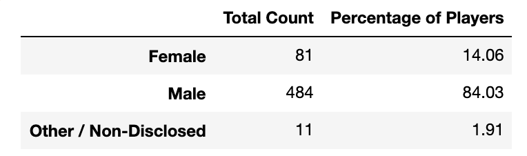
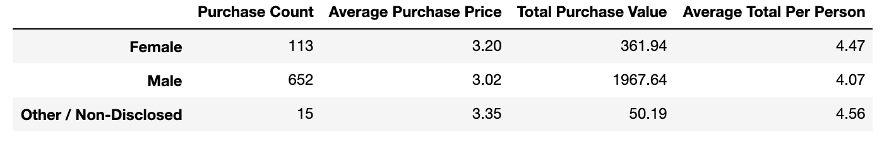
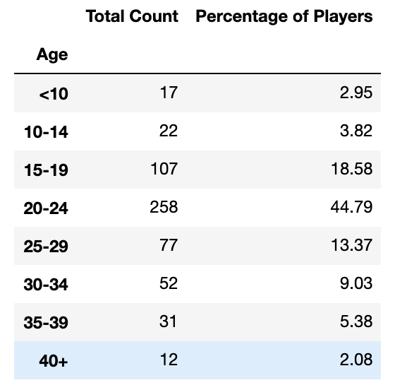
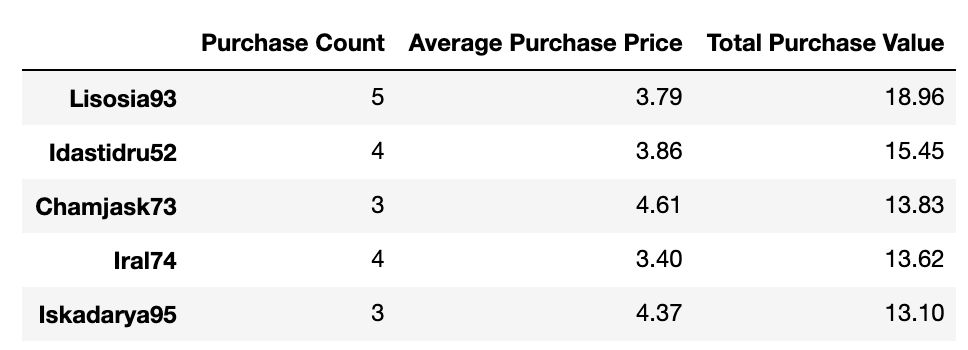
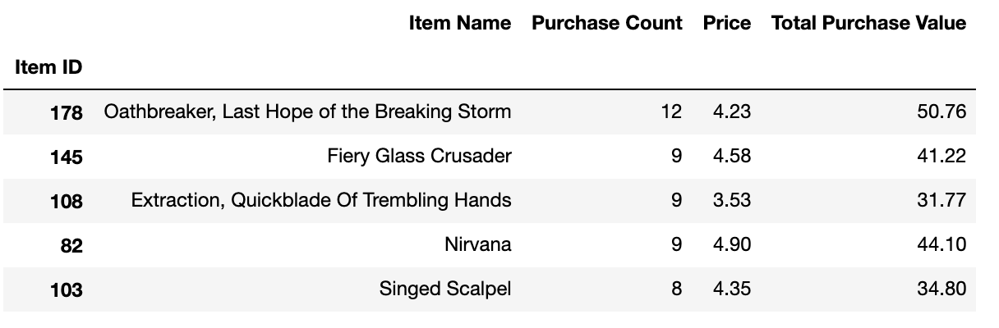
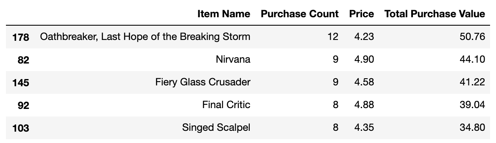

# Heroes of Pymoli
Pandas-Challenge HW

## Matthew Richtmyer | 14 Dec 2019

__Objectives__
  * Analyze data from an independent gaming company to uncover purchasing trends
  
__Approach__

Calculate spend with respect to demographics including:
  * Player count (i.e. total number of players)
  * Purchase Analysis (i.e. number of unique items, avg purchase price)
  * Gender demographics and purchasing trends across gender
  * Age demographics
  * Top spenders
  * Most popular and profitable items purchased
  
__Notebook__
[Code](https://github.com/mrichtmyer/pandas-challenge/blob/master/HeroesOfPymoli/HeroesOfPymoli_starter.ipynb)


## Player Count
The data was read in using a pandas dataframe and the total number of players was found by taking the length of the unique screen names (e.g. key "SN"). 

__Code__
```
total_players = len(purchase_data["SN"].unique())
df_total_players = pd.DataFrame({"Total Players": [total_players]})
df_total_players
```

__Output__


## Purchasing Analysis (Total)
Aggregate methods like .mean() and .sum() were used to describe unique sections of data and describe the general population. A dataframe was then created to format output. 


__Code__

```
# Calculate Purchase Analysis metrics
num_items = len(purchase_data["Item ID"].unique())
avg_price = np.round(purchase_data["Price"].mean(),decimals=2)
num_purchase = len(purchase_data)
total_revenue = np.round(purchase_data["Price"].sum(), decimals=2)

# Create summary dataframe
df_summary = pd.DataFrame({"Number of Unique Items": [num_items], "Average Price": avg_price,
                           "Number of Purchases": num_purchase, "Total Revenue": total_revenue})

# come back and reformat

df_summary.head()
```
__Output__


## Gender Demographics
To calculate the proportions of each gender playing this game, a groupby was used on "Gender". We used the "SN" key to filter by screen name so that we would only get unique players (i.e. not count a repeat buyer and dilute the proportions and skew the data). 

__Code__
```
# perform groupby
gb = purchase_data.groupby(["Gender"])["SN"].nunique()
total_count = [x for x in gb]
percentage_of_players = [np.round(x/np.sum(total_count),decimals=4)*100 for x in gb]

df_gender = pd.DataFrame({"Total Count":total_count, "Percentage of Players": percentage_of_players},
                        index=["Female","Male","Other / Non-Disclosed"])
df_gender
```

__Output__




## Purchase Analysis by Gender
Describe relative purchasing based on gender. A groupby method was used to group on "Gender" and then a custom function call (dict_totals_per_gender) was created to create a dictionary of Screen Name -> Total Purchase key/value pairs. This structure was decided so that it would be easy to do a dictionary lookup to analyze any deeper purchasing trends by person. 

__Function dict_totals_per_gender__


    def dict_totals_per_gender(gender_key):
    
        """ Docstring: dict_totals_per_gender takes input key (as a string) and returns a dictionary of all unique
        players for that gender with their corresonding purchase total. Also returns the mean value spent per gender.
        To be used for general gender purchase analysis"""

        # grab list of unique names
        unique_names = list(gb2[gender_key]["SN"].unique())
        # preallocate a dictionary with keys as screen name and values as zero
        totals = {keys:0 for keys in unique_names}

        # for every key in totals, pull a subset dataframe consisting of only that person's purchases and sum them
        for key in totals:
            df_temp = purchase_data.loc[purchase_data["SN"]==key,:]
            totals[key] += df_temp["Price"].sum()

        return totals, pd.Series([totals[k] for k in totals]).mean()


Once this function was created, it was used several times to find the dictionaries of users and their purchases across gender. The dictionaries were then summed or averaged to get respective columns in the output (shown below). 


__Output__




## Age Demographics
In this section, the number of people per age bracket was calculated. A groupby was performed on Ages, and then the unique screen names were filterd to ensure that we are not double counting people. This method is more brute-force, but manually calls the list for the corresponding ages per group. These were then passed through a dictionary for key-value pair storage and finally passed to a pd.DataFrame. 

__Code__

```
# group by ages and only get one count per screen name (i.e. only count age once for those who made multiple
# purchases)
group_age = purchase_data.groupby("Age")["SN"].nunique()
# convert pd.Series object back into pd.DataFrame
group_age = pd.DataFrame(group_age)

# manually segment... could try to use a groupby but haven't gotten that to work yet. 
under_10 = group_age["SN"][7] + group_age["SN"][8] + group_age["SN"][9]
age_10to14 = group_age["SN"][10] + group_age["SN"][11] + group_age["SN"][12] + group_age["SN"][13] + group_age["SN"][14]
age_15to19 = group_age["SN"][15] + group_age["SN"][16] + group_age["SN"][17] + group_age["SN"][18] + group_age["SN"][19]
age_20to24 = group_age["SN"][20] + group_age["SN"][21] + group_age["SN"][22] + group_age["SN"][23] + group_age["SN"][24]
age_25to29 = group_age["SN"][25] + group_age["SN"][26] + group_age["SN"][27] + group_age["SN"][28] + group_age["SN"][29]
age_30to34 = group_age["SN"][30] + group_age["SN"][31] + group_age["SN"][32] + group_age["SN"][33] + group_age["SN"][34]
age_35to39 = group_age["SN"][35] + group_age["SN"][36] + group_age["SN"][37] + group_age["SN"][38] + group_age["SN"][39]
age_40to45 = group_age["SN"][40] + group_age["SN"][41] + group_age["SN"][42] + group_age["SN"][43] + group_age["SN"][44] + group_age["SN"][45]

age_list = [under_10, age_10to14, age_15to19, age_20to24, age_25to29, age_30to34, age_35to39, age_40to45]
age_labels = ["<10", "10-14","15-19","20-24","25-29","30-34","35-39","40+"]
# preallocate dictionary
age_dict = {}

# loop through all ages in list and define them to the age class. Use this dictionary later to create our
# output dataframe
counter = 0
for age in age_list:
    age_dict[age_labels[counter]] = [age]
    counter += 1


age_df = pd.DataFrame(age_dict).transpose()
age_df.columns = ["Total Count"]
age_df.index.name = "Age"
#age_df

# group by age categories we defined in bin labels
gb3 = df_age_demographics.groupby("Age Groups").count()
# format percentage of age group
percent_age_group = [age/age_df["Total Count"].sum()*100 for age in age_df["Total Count"]]
percent_age_group = np.round(percent_age_group,decimals=2)

age_df["Percentage of Players"] = percent_age_group
age_df

```

__Output__



## Purchasing Analysis by Age
An analogous function to dict_totals_per_gender was defined to create key-value pairs to store all individuals with a specific age criteria and their corresponding spend in one data structure. This function was called for each age group.

__Output__

~[](HeroesOfPymoli/age_analysis.png)

## Top Spenders
The five top spenders were identified and their spending statistics are displayed (e.g. total spent, average spent per purchase, etc.). This was done by using dictionaries, where unique screen names were used as keys and the corresponding values were the total that individual spent. This dictionary was converted into a dataframe and was sorted. The output is showing the top five spenders using the .head(5) command. 

__Code__

    # grab list of unique names
    unique_names = list(purchase_data["SN"].unique())

    # preallocate a dictionary with keys as screen name and values as zero
    purchase_count = {keys:0 for keys in unique_names}
    total = {keys:0 for keys in unique_names}

    # for every key in totals, pull a subset dataframe consisting of only that person's purchases and sum them
    for ii in range(0,len(purchase_data)):
        # get screen name from row ii
        screen_name = purchase_data["SN"][ii]

        # number of purchases
        purchase_count[screen_name] += 1

        # total
        total[screen_name] += purchase_data["Price"][ii]
        
        # construct data frame with dictionaries previously constructed
    df_top_spenders = pd.DataFrame({"Purchase Count": purchase_count,"Total Purchase Value": total})
    # calculate average purchase price column for dataframe
    df_top_spenders["Average Purchase Price"] = np.round(df_top_spenders["Total Purchase Value"] / df_top_spenders["Purchase Count"] , decimals=2) 
    # reorder columns
    df_top_spenders = df_top_spenders[["Purchase Count", "Average Purchase Price", "Total Purchase Value"]]
    # sort Data Frame and print top 5 spenders
    df_top_spenders.sort_values(by="Total Purchase Value",ascending=False).head(5)
    

__Output__



## Most Popular Items
The most popular items were calculated to show purchasing trends. Dictionaries were used to store key value pairs for quick look-up later and for easy DataFrame creation. The output dataframe was sorted in descending order. 

__Output__




## Most Profitable Items
The most profitable items were calculated by simply sorting the previous dataframe. 

__Output__




