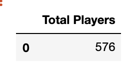
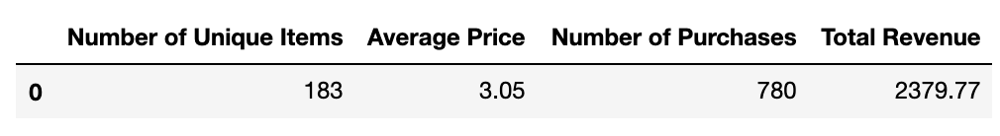

# Heroes of Pymoli
Pandas-Challenge HW

## Matthew Richtmyer | 14 Dec 2019

__Objectives__
  * Analyze data from an independent gaming company to uncover purchasing trends
  
__Approach__

Calculate spend with respect to demographics including:
  * Player count (i.e. total number of players)
  * Purchase Analysis (i.e. number of unique items, avg purchase price)
  * Gender demographics and purchasing trends across gender
  * Age demographics
  * Top spenders
  * Most popular and profitable items purchased
  
__Notebook__
[Code](https://github.com/mrichtmyer/pandas-challenge/blob/master/HeroesOfPymoli/HeroesOfPymoli_starter.ipynb)


## Player Count
The data was read in using a pandas dataframe and the total number of players was found by taking the length of the unique screen names (e.g. key "SN"). 

__Code__
```
total_players = len(purchase_data["SN"].unique())
df_total_players = pd.DataFrame({"Total Players": [total_players]})
df_total_players
```

__Output__



## Purchasing Analysis (Total)


__Code__

```
# Calculate Purchase Analysis metrics
num_items = len(purchase_data["Item ID"].unique())
avg_price = np.round(purchase_data["Price"].mean(),decimals=2)
num_purchase = len(purchase_data)
total_revenue = np.round(purchase_data["Price"].sum(), decimals=2)

# Create summary dataframe
df_summary = pd.DataFrame({"Number of Unique Items": [num_items], "Average Price": avg_price,
                           "Number of Purchases": num_purchase, "Total Revenue": total_revenue})

# come back and reformat

df_summary.head()
```
__Output__

